# regression_genetic_algorithim

This repo is an approach to solving the known problem of regression using a evolutionary algorithm. More specifically using evolution strategy.

The approximation of the function is done by a sum of Gaussian kernels:

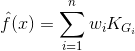

where $ K_{G_i} $ is defined as:

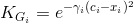

Then what we are trying to optimize is the set of parameters: 

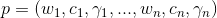

To minimize the error of the pair:

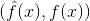


The following functions have been added as a sample:

Function1:

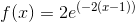

Function2:

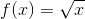

Function3:


Function4:

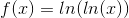

Function5:

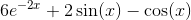


We are using the following error:

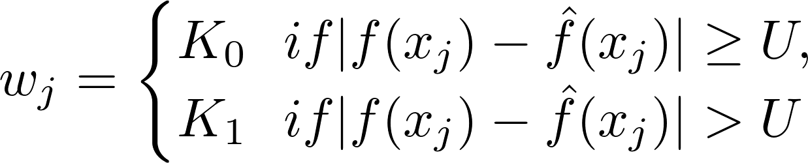


However mean squared error and absolute mean error are available in the code as well.


| Predicted function vs True function   | Mean and max fitness per generation   |
| ------------------------------------- | ------------------------------------- |
| 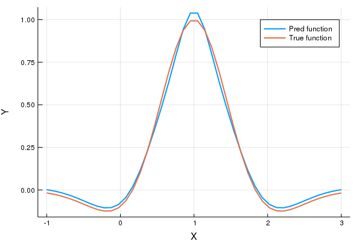 | 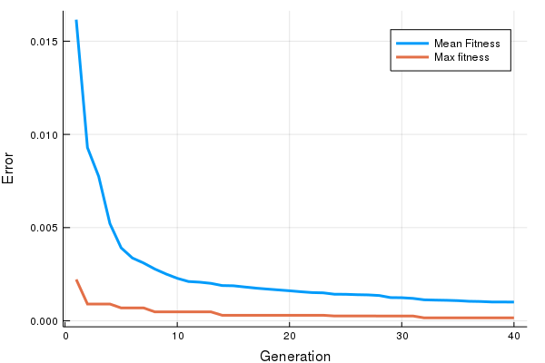 |
|  | 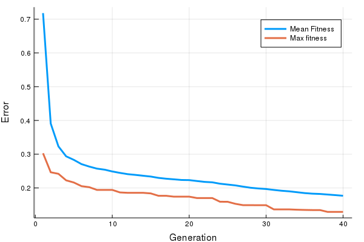 |
| 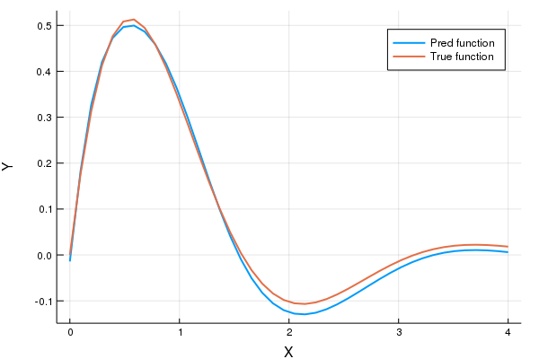 | 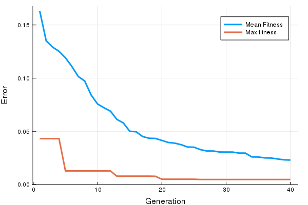 |
| 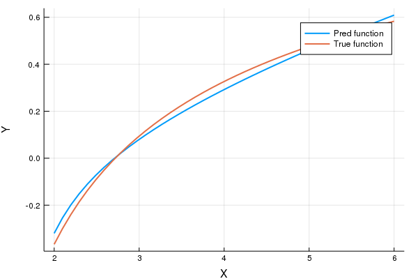 | 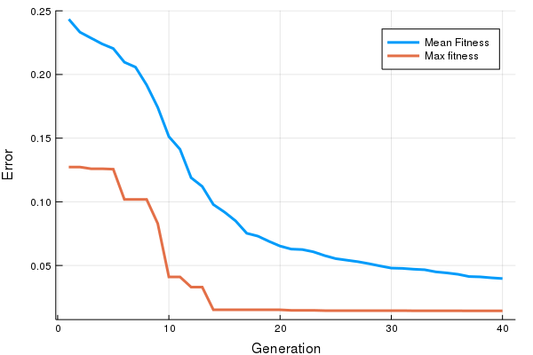 |
| 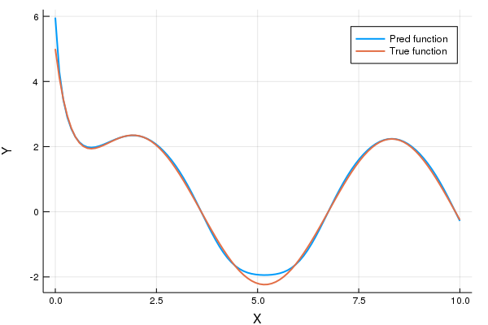 | 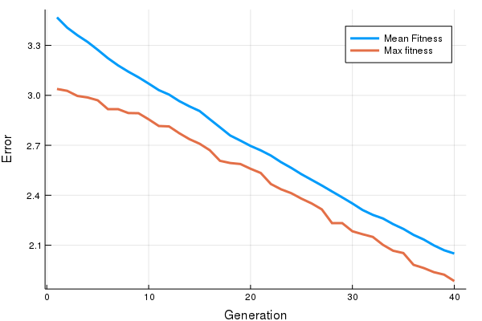 |
|                                       |                                       |

Since the error we are using allows to track a pseudo hit ratio, here are the outputs of such metric for all 5 functions:

| Function  | Hit ratios for fittest             |
| --------- | ---------------------------------- |
| Function1 | 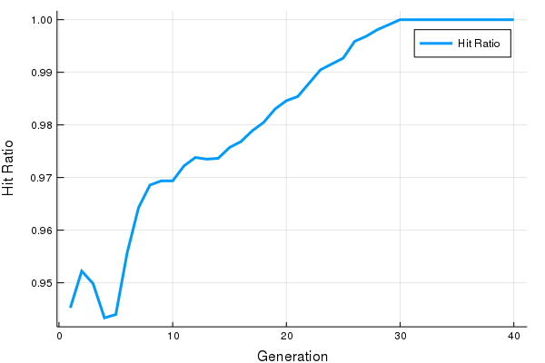 |
|           |                                    |
| Function2 | 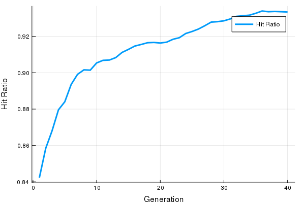 |
| Function3 | 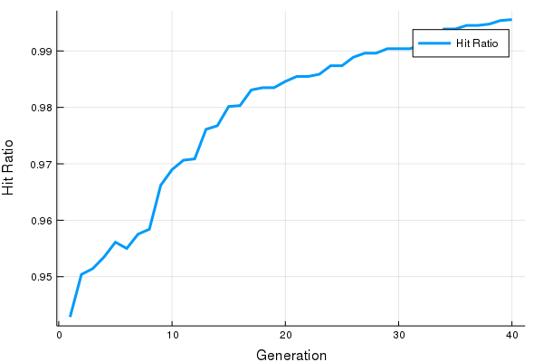 |
| Function4 | 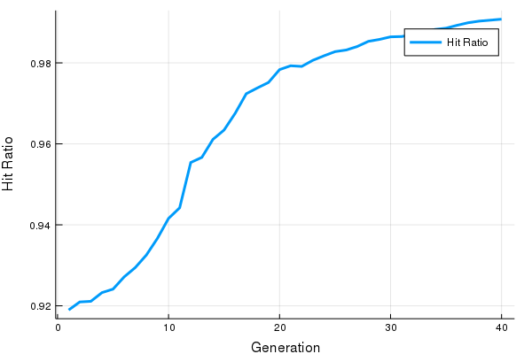 |
| Function5 | 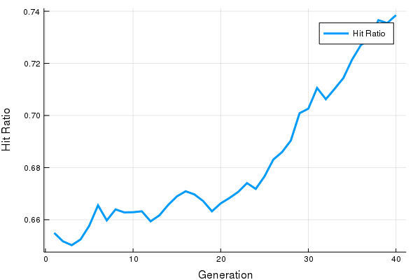 |


### Demo

The file `algo_params.json` contains the parametrization of the algorithm.

```
{
	"num_runs": 10,
	"num_generations": 40,
	"population_size": 41,
	"n_kernels": 4,
	"σ_initial": 1,
	"λ_children": 200,
	"μ_parents": 30,
	"recombination_type": "discrete_recombination",
	"mutation_type": "uncorr_mutation_n_stepsize",
	"error_function": "weighted_mean_abs_error",
	"threshold": 0.1,
	"lower_weight": 1.0,
	"upper_weight": 10.0,
	"evaluate_function": "function1",
	"x_range": [-1, 3],
	"survivor_selection": "all"
	"output_file": ""
}

```

Change the parameters desired and then run `algo_runner.jl`.

Error, functions and hit ratio graphs will be generated under the folder `outputs/` and then given the name in the parameters as `output_file`. If empty or blank spaces, graphs wont be saved and will be displayed instead.